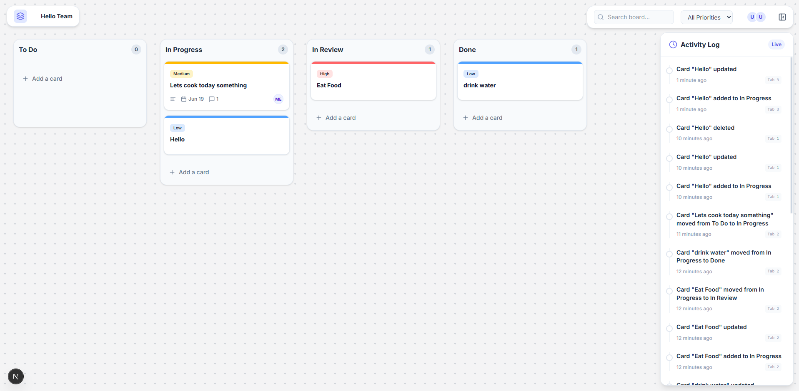

# KanbanFlow: Collaborative Whiteboard

A fast, local-first, and collaborative Kanban board built for the Infravox AI Frontend Internship Technical Assignment.



*UI inspired from Miro.*

## 🚀 The Mission

Project management tools are ubiquitous but often suffer from network latency and backend round-trips. This application aims to solve that by providing a **100% client-side, zero-latency experience**. 

It uses a pristine **Miro-style Collaborative Whiteboard** aesthetic, placing user experience and real-time collaboration at the forefront without relying on any backend databases or APIs.

## ✨ Core Features

- **Blazing Fast & Local-First:** No loading spinners, no API calls. Everything runs instantly in the browser.
- **Real-Time Collaboration (Multi-Tab):** Open the app in two tabs side-by-side. Drag a card in Tab A, and watch it instantly update in Tab B, complete with a real-time "In Transit" visual indicator! Powered entirely by the native HTML5 `BroadcastChannel` API.
- **Robust State Management:** Built with Zustand. The entire application state (Cards, Columns, Activity Log) lives in a single, easily debuggable store.
- **Drag and Drop:** Fluid, animated drag-and-drop using `@dnd-kit/core`.
- **Persistent Storage:** State is automatically persisted to `localStorage` (debounced at 250ms for performance).
- **Miro-Style Aesthetic:** A vast, infinite light-gray dotted canvas with soft, floating white toolbars, perfectly mirroring modern collaborative whiteboard tools.
- **No External Component Libraries:** All UI primitives (Buttons, Badges, Confirm Prompts, Cards) were built from scratch using pure Tailwind CSS—no ShadCN or Material UI.

## 🛠️ Tech Stack

- **Framework:** Next.js 14 (React)
- **Language:** TypeScript
- **Styling:** Tailwind CSS v4
- **State Management:** Zustand
- **Drag & Drop:** `@dnd-kit/core`
- **Real-Time Sync:** Native browser `BroadcastChannel` API
- **Icons:** `lucide-react`
- **Date Formatting:** `date-fns`

## 📦 Getting Started

Since this project has absolutely no backend dependencies, getting started is incredibly simple:

1. **Clone the repository:**
   ```bash
   git clone <your-repo-url>
   cd infravox
   ```

2. **Install dependencies:**
   ```bash
   npm install
   ```

3. **Start the development server:**
   ```bash
   npm run dev
   ```

4. **Experience the Magic:**
   - Open [http://localhost:3000](http://localhost:3000) in your browser.
   - **Duplicate the tab** so you have two windows open side-by-side.
   - Move a card in one window, and watch it instantly sync to the other window!

## 🧪 Testing the Requirements

- **Real-time Syncing:** Tested by opening multiple tabs.
- **Performance:** `localStorage` writing is debounced to 250ms, ensuring drag-and-drop animations remain silky smooth (60fps).
- **UI Interaction:** Double-click a column name to rename it. Edit card details (including due dates and comments) via the floating right-side panel. Due dates will automatically highlight in red if overdue.

## 📡 BroadcastChannel Architecture

The application relies on the native HTML5 `BroadcastChannel` API to sync state without a backend.
- **Sync Mechanism:** State mutations update the local Zustand store and simultaneously broadcast a typed `sync_state` or `drag_state` event.
- **Echo Prevention:** The app generates a unique `tabId` on initialization. Every outgoing broadcast includes this ID. The channel listener ignores messages where the `tabId` matches its own, preventing infinite echo loops.
- **Late-Joining Tabs:** A newly opened tab hydrates its state from `localStorage` (the most recent debounced write) before processing new BroadcastChannel events.
- **Tab Registry:** A dedicated tab registry hook broadcasts events when tabs are opened or closed to keep the active tab counter accurate.

## ⚠️ Known Limitations

- **Conflict Resolution:** If two tabs edit the board simultaneously, the last broadcast received overwrites the other (Last-Write-Wins). A production-ready approach would use CRDTs (like Yjs) or granular operational transforms.
- **Storage Limits:** State is serialized to `localStorage`, limiting the board to the browser's ~5MB quota limit.

## 🎥 Demo Video

[Watch the Demo Video (Google Drive)](https://drive.google.com/file/d/1e62ICLeyBtNH62lOrp920k09Q5Bd_F7F/view?usp=sharing)

---
*Built as a technical assignment for Infravox AI.*


